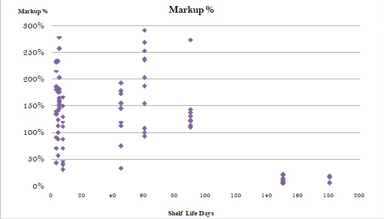
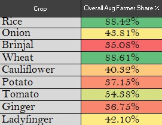
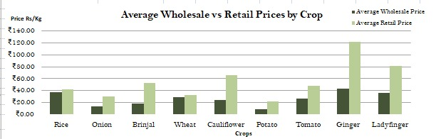
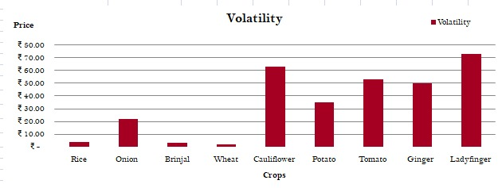
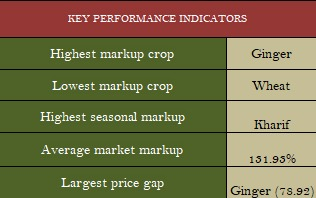

# Agricultural Supply Chain Analytics Case Study

## Overview
This project is an Excel-based data analytics case study focused on understanding the gap between wholesale and retail vegetable prices in India.

Using market price data from Agmarknet and FSD Delhi, the analysis explores why consumers often pay significantly higher prices for vegetables while farmers still receive a relatively small share of the final consumer price.

The project combines data analysis, visualization, KPI tracking, correlation analysis, and policy recommendations to examine supply chain inefficiencies across different crops and seasons.

## Objectives
The project was designed to analyze:

- Wholesale vs retail price gaps
- Farmer's share of consumer spending
- Seasonal price fluctuations
- Crop-wise markup percentages
- Supply chain inefficiencies
- Impact of perishability and transport burden on pricing

## Tools & Techniques Used

- Microsoft Excel
- Pivot Tables
- Conditional Formatting
- KPI Dashboards
- Scatter Plots & Bar Charts
- Correlation Analysis
- Data Cleaning & Transformation

## Dataset Information

### Data Sources
- Agmarknet
- FSD Delhi Market Price Data

### Crops Included
- Rice
- Wheat
- Onion
- Potato
- Tomato
- Ginger
- Brinjal
- Ladyfinger
- Cauliflower

### Seasons Analyzed
- Kharif
- Rabi
- Zaid

## Key Metrics Calculated

### Markup %
Measures the percentage increase from wholesale to retail price.

### Farmer's Share %
Represents the percentage of the consumer price received by farmers.

### Price Gap
Difference between wholesale and retail prices.

Retail prices consistently exceeded wholesale prices across all crops, highlighting strong intermediary margins and supply chain inefficiencies.

### Volatility
Measures fluctuations in crop prices across dates and seasons.

Highly perishable vegetables showed significantly greater price volatility compared to staple crops such as rice and wheat.

## Key Findings

- Certain crops recorded markups above 400%, especially during off-season periods.
- Perishable vegetables consistently showed higher retail inflation compared to staple commodities.
- Farmers often received less than half of the final consumer price.
- Crops with shorter shelf life showed significantly higher markups.
- Transport burden and storage limitations strongly influenced retail prices.
- Rice and wheat maintained relatively stable pricing and higher farmer share percentages across seasons.

## Correlation Insights

The analysis showed:

- Negative correlation between shelf life and markup percentage.
  - Shorter shelf life → Higher markup

- Positive correlation between transport burden and markup percentage.
  - Higher logistics difficulty → Higher retail inflation

---

## KPI Analysis

The dashboard includes:
- Highest markup crop
- Lowest markup crop
- Highest seasonal markup
- Average market markup
- Largest wholesale-retail price gap

---

## Policy Recommendations

Based on the findings, the project recommends:

- Expanding cold-chain infrastructure
- Improving mandi price transparency
- Supporting direct farmer procurement models
- Reducing transport inefficiencies for perishable crops

---

## Files Included

- Excel Dashboard
- LinkedIn Carousel PDF
- Dashboard Screenshots

---

## Project Motivation

This project was built to explore a real-world economic question:

> Why do consumers pay high vegetable prices while farmers still struggle to earn enough?

The analysis attempts to understand how supply chain inefficiencies, perishability, transportation costs, and intermediary margins contribute to this pricing gap.

---

## Author

Kamakshi Dhamija  
Aspiring Data Analyst
